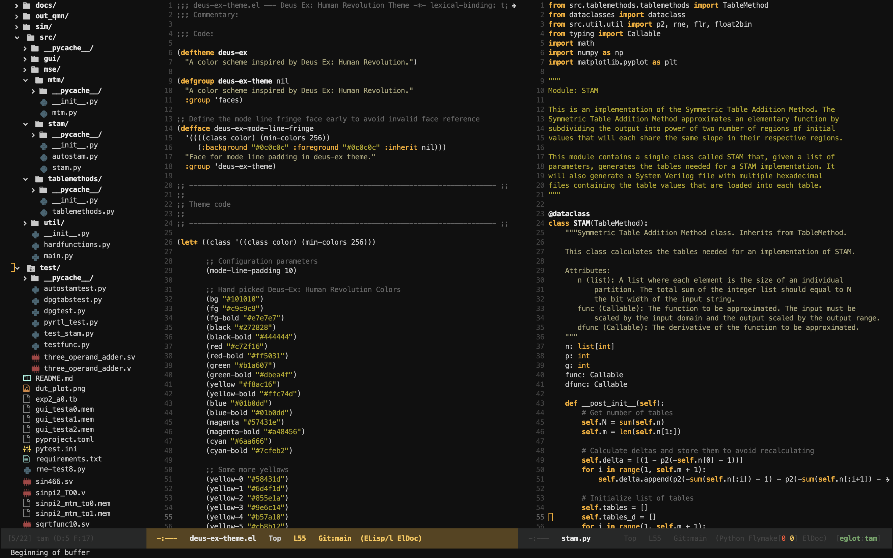

# Emacs Prime
Emacs prime is a silly name for this repo so I may change it later. I believe that being unfamiliar with the tools you use leads to lost hours of productivity. Thus, I wanted to become more familiar with Emacs customization and Elisp syntax to improve my coding experience and speed up my workflow by taking advantage of some of Emacs' more advanced features. Additionally, as a Computer Engineer who frequently codes in System Verilog, I wanted to customize how Emacs dealt with System Verilog as many of the default Emacs behaviors in verilog-mode make it painful to write with.

Also, I'm a fan of Deus Ex: Human Revolution's gold color scheme. There are not many themes that replicate this look, so I color picked a color scheme straight from the game. The theme is a work-in-progress and not all modes and features have been added to the theme.

Many parts of this configuration have been borrowed from Jessie Hildebrandt's dot-emacs configuration here: https://gitlab.com/jessieh/dot-emacs

The theme also borrows elements of Jessie Hildebrandt's Adwaita Dark theme: https://gitlab.com/jessieh/adwaita-dark-theme

This configuration will likely change signifcantly as I learn more about Emacs and my preferences change.

# Tree Sitter
Tree sitter support is required in order to use this configuration. A recent version of Emacs beyond version 29.

# Verilog Support
Many things about writing in System Verilog have been optimized in this configuration. Below the changes are described.

## Formatting and Indentation

## Tempel
In order to get the System Verilog templates to work in `verilog-mode` and `verilog-ts-mode`, a couple of things had to be changed. These changes may be able to worked into the official verilog-ts-mode repository someday, but for now I'll describe them here.

Indentation inside templates will not work in `verilog-ts-mode` by default. In order to get it working, the indentation function of `verilog-mode` needs to be set to 
